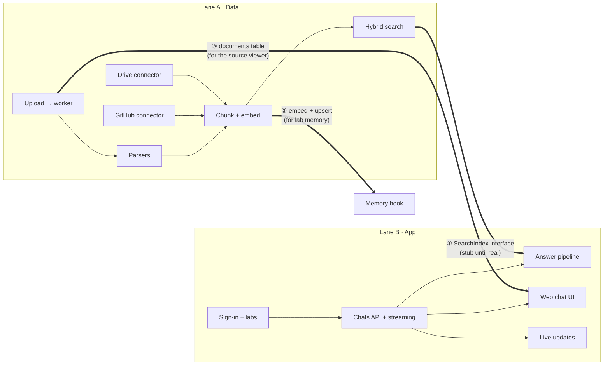
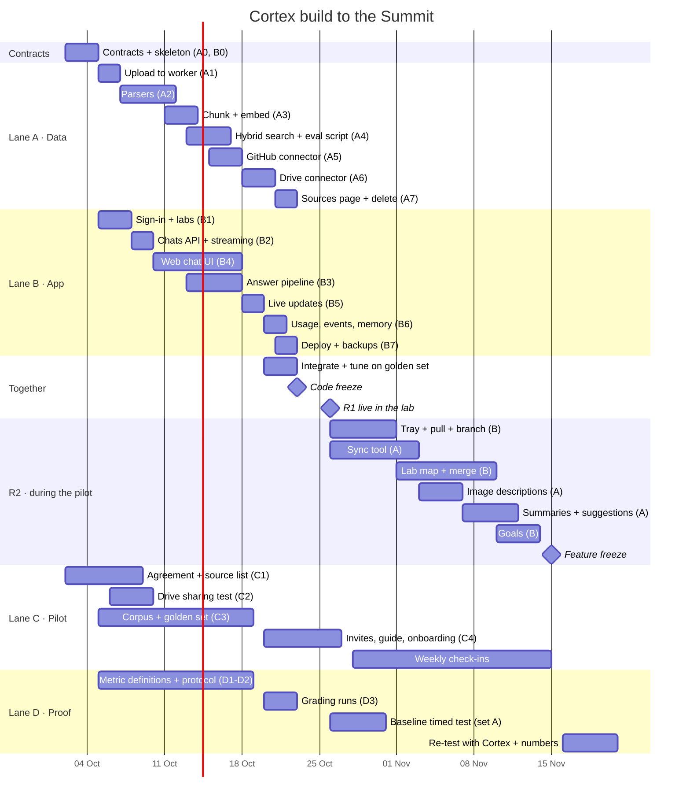

# Cortex Development Plan

> Who builds what, in what order, and what can run side by side. Version 0.1 · 2 Oct 2026
> Read with [`SPEC.md`](SPEC.md) and [`ARCHITECTURE.md`](ARCHITECTURE.md). Requirement IDs (like `ASK-1`) refer to the spec.

---

## 1. The team and the time we have

| Lane | Person | Hours/week | Owns |
|------|--------|-----------|------|
| **A · Data** | Builder A `[name]` | ~15 until 26 Oct, then ~10 | Ingestion, parsing, search, connectors, sync tool |
| **B · App** | Builder B `[name]` | ~15 until 26 Oct, then ~10 | Sign-in, chats, the answer pipeline, web app, live updates, the lab map, deploy |
| **C · Pilot** | `[name]` | ~10 | The PI relationship, pilot agreement, test corpus, golden set, accounts, onboarding, weekly check-ins |
| **D · Proof + pitch** | `[name]` | ~10 | Metrics, the timed test, grading answers, the deck, the demo |

**Build hours:** about 105 before R1 (26 Oct) and about 45 for features during the pilot. That's after ~5 hrs/week of bug fixing and pilot support.

**Key dates**

| Date | What |
|------|------|
| Fri 2 – Sun 4 Oct | Contracts + skeleton (§3). After this, lanes A and B work independently |
| Sun 11 Oct | Demo: upload a folder, ask a question in the web app (search stubbed or real) |
| Sun 18 Oct | Demo: real cited answers from GitHub + uploads, live in two browsers |
| Tue 20 – Thu 22 Oct | Integration + golden-set tuning |
| **Fri 23 Oct** | **R1 code freeze** (go-live checklist, `SPEC.md` §14.1) |
| **Mon 26 Oct** | **R1 live in the pilot lab** + onboarding |
| 26 – 30 Oct | Baseline timed test (the lab's usual way) |
| Weekly from 26 Oct | R2 items ship behind feature flags, turned on for the lab |
| **Sun 15 Nov** | **Feature freeze** |
| 16 – 20 Nov | Re-test with Cortex, collect numbers, PI quote, price question, rehearse |
| Late Nov | Summit |

---

## 2. Why this splits cleanly in two

Lanes A and B meet at exactly three points. If those are agreed on day 0, each builder can go two weeks without waiting for the other.



1. **`SearchIndex` interface** (`ARCHITECTURE.md` §3.1). B builds the answer pipeline against a `FixtureSearchIndex` that returns hand-picked chunks from the test corpus. When A's real index lands, swap one environment variable.
2. **Embed + upsert** so B can index Q&A as lab memory (`MEM-1`). Until then, B's memory hook just enqueues a job that A's worker handles.
3. **Documents and chunks tables** so the citation side panel can show the source. A owns the schema. B reads it.

The frontend also never waits for the backend. It builds against a **mock server generated from `api/openapi.yaml`**, plus recorded live events.

---

## 3. Day 0–2: contracts first (Fri 2 – Sun 4 Oct)

Both builders, about 5 hours each. Nothing else starts until these are merged.

- [ ] **Repo + skeleton** (A): monorepo layout from `ARCHITECTURE.md` §10, `docker-compose.yml` with Postgres + pgvector, Redis and MinIO, Alembic set up, CI running lint + type checks + tests.
- [ ] **Ports** (A): `packages/core/ports.py` exactly as in `ARCHITECTURE.md` §3.1, with one fake adapter each (`FakeLLM`, `FixtureSearchIndex`, `MemoryObjectStore`) for tests.
- [ ] **Schema v1** (A): `labs, users, memberships, invites, sources, documents, blobs, chunks, chats, chat_edges, messages, citations, context_items, context_manifests, feedback, events, audit_log`. Include `chat_edges` and `context_items` now even though they're mostly R2, so we don't migrate under pressure later.
- [ ] **OpenAPI v1** (B): every R1 endpoint in `SPEC.md` §10, with request/response examples. Commit `api/openapi.yaml`. Generate TypeScript types. Start a mock server from it.
- [ ] **Live event schema** (B): `api/events.schema.json` for every event in `SPEC.md` §10.
- [ ] **Web skeleton** (B): React app with routing, sign-in page, empty chat view, wired to the mock server.
- [ ] **Golden set format** (D): `eval/golden.yaml` (question, type, expected answer, expected files, notes) with 5 example rows.
- [ ] **Pilot kick-off** (C): meeting booked with the PI. Draft pilot agreement (`SPEC.md` §12) sent.

---

## 4. R1 task cards (5 Oct – 23 Oct)

Hours are estimates for an experienced student using AI coding tools. **Base total: A ≈ 52 h, B ≈ 53 h.** Stretch items only happen if a lane is ahead.

### Lane A · Data

| ID | Task | Spec | Est. | Depends on | Done when |
|----|------|------|------|-----------|-----------|
| A0 | Skeleton, ports, schema (day 0) | — | 5 h | — | §3 boxes ticked |
| A1 | Upload endpoint → object storage → `ingest_file` job → worker; document records; hash dedupe | SRC-1, READ-2, READ-3 | 5 h | A0 | Uploading a 300-file folder creates 300 documents and jobs |
| A2 | Parsers: Docling (PDF incl. OCR, DOCX, PPTX, XLSX), text/MD/LaTeX/HTML, tree-sitter code, notebooks, sheet summaries, metadata-only; timeouts + failure rows | READ-1 | 11 h | A1 | Every READ-1 row parses 2+ corpus files. A corrupt file becomes a `failed` row and doesn't stop the batch |
| A3 | Chunker with headers, `models` service (embed + re-rank over HTTP), batch upsert of chunks with `tsv` + vector | ARCH §4.1 | 6 h | A2 | Whole test corpus indexed. Chunk counts per type look right |
| A4 | Hybrid search: keyword + vector + metadata, RRF, re-rank flag, filters; `GET /search`; `eval/run_eval.py` for retrieval metrics | ASK-3, ASK-4, ARCH §5.1 | 8 h | A3 | Expected file in top 10 for ≥ 90% of golden questions on the corpus |
| A5 | GitHub App: install flow, initial sync, push webhook (HMAC check), 30-min reconcile, deep links with line ranges | SRC-2 | 7 h | A3 | A push is searchable in < 5 min. A delete disappears in < 5 min |
| A6 | Drive: service account, list shared folders, changes feed every 10 min, Google file exports, deep links | SRC-3 | 7 h | A3 | A new file in the shared folder is searchable in < 15 min |
| A7 | Sources page API + simple page, "Sync now", disconnect → `delete_source` job | SRC-5, SRC-6 | 3 h | A5 | After disconnect, a unique phrase from that source returns nothing |

### Lane B · App

| ID | Task | Spec | Est. | Depends on | Done when |
|----|------|------|------|-----------|-----------|
| B0 | OpenAPI, event schema, mock server, web skeleton (day 0) | — | 4 h | — | §3 boxes ticked |
| B1 | Google + GitHub sign-in (OIDC), sessions, labs, invite links, roles, `403` checks | AUTH-1, LAB-1, LAB-2 | 7 h | B0 | Invited member joins in < 1 min. Uninvited user is blocked. Member gets `403` on PI actions |
| B2 | Chats + messages API, SSE streaming (echo model first), message status | SHARE-1, ASK-7 | 5 h | B1 | Two chats, streamed echo replies, stored and reloadable |
| B3 | Answer pipeline: rewrite + intent (fast model), call `SearchIndex`, context assembly (R1 parts), prompt, LLM gateway, citation check, context manifest | ASK-1, ASK-2, ASK-5, CTX-8, ARCH §5 | 10 h | B2 (+ A4 for real results) | With the fixture index: cited answers, "not found" works, every AI message has a manifest |
| B4 | Web: lab chats list + search, chat view (streaming, citation chips, source side panel, "not found" state, find-results list), "What did the AI see?", feedback buttons | ASK-1…6, SHARE-1 | 13 h | B2 (mock server earlier) | Demo script steps 2, 3 and 8 work in the browser |
| B5 | WebSocket + Redis pub/sub, live messages and deltas, presence, typing | SHARE-2 | 5 h | B2 | Two browsers on one chat see each other's messages in < 2 s |
| B6 | Event log, usage page, audit log, memory hook (`index_memory` job) | MET-1, MET-2, ADM-1, MEM-1, MEM-2 | 5 h | B3, A3 | Usage page shows real numbers from a dry run. A re-asked question cites the old chat |
| B7 | Deploy: VM, compose, Caddy TLS, `.env`, nightly backup + one restore test, Sentry | ARCH §8 | 4 h | all | `SPEC.md` §14.1 infra boxes ticked |

### Together (inside the estimates above)

| When | What |
|------|------|
| Tue 20 – Thu 22 Oct | Swap the fixture index for the real one. Run the golden set on the pilot lab's real sources. Fix search first (chunking, headers, keyword weighting), prompts second |
| Fri 23 Oct | Go-live checklist. Freeze |

### Stretch (only if a lane is ahead)

ASK-4 filter chips (2 h) · SHARE-3 auto titles (1 h) · SHARE-4 markdown export (2 h) · CTX-3 pin a file (3 h) · MET-3 timed-test page (3 h; a spreadsheet works instead) · start the R2 map frontend against mock data (see §6).

### Lane C · Pilot (5 – 26 Oct)

| ID | Task | Done when |
|----|------|-----------|
| C1 | Pilot agreement signed. List of repos, folders and machines. Member list. Sensitivity check with the PI | Signed copy saved. Nothing sensitive on the list |
| C2 | **Test Drive sharing with the service account from a GT account** (week 1, needs the email from A6) | We know by Fri 9 Oct whether the Drive plan works or we fall back |
| C3 | Test corpus (~300 files covering every READ-1 row) + golden set (40 questions per `SPEC.md` §13) written with lab members | `eval/golden.yaml` complete by Sun 18 Oct |
| C4 | Invites, a one-page "how to use Cortex" guide, a 30-min onboarding on 26 Oct, 5 seed chats with useful answers | Every member signed in on day 1 |

### Lane D · Proof + pitch (5 – 26 Oct)

| ID | Task | Done when |
|----|------|-----------|
| D1 | Write down how each Summit number is computed. Check the usage page against it | Definitions agreed with both builders |
| D2 | Timed-test protocol: 20 real questions in two matched sets of 10 (A and B). Set A is timed the usual way in week 1. Set B is timed with Cortex in mid-November. If time allows, swap them too | Protocol + timing sheet ready by 23 Oct |
| D3 | Grading sheet for citation support on the golden set (by hand, or with an AI grader checked by hand) | First graded run on 22 Oct |
| D4 | Keep the deck current. Turn the demo script (`SPEC.md` §14.2) into a rehearsed 3-minute live demo | Rehearsed once before the pilot, once after |

---

## 5. The parallel timeline



---

## 6. R2 backlog (26 Oct – 15 Nov)

Default order. **Change it every Wednesday based on what the lab asks for** (C brings the top request).

| # | ID | Task | Spec | Lane | Est. | Notes |
|---|----|------|------|------|------|-------|
| 1 | R2-1 | Context tray, pull a chat (button + list), branch, context budget + "used summaries" note | CTX-1, CTX-2, CTX-4, CTX-7 | B | 10 h | Pull uses the last 6 messages until summaries exist (R2-5) |
| 2 | R2-2 | Sync tool: device-code sign-in, folder picker, watcher, resumable uploads, deletions, device list + revoke | SRC-4 | A | 12 h | Test on the lab's OneDrive folder in week 1 |
| 3 | R2-3 | Lab map: React Flow canvas, `ChatNode`, 3 edge styles, auto-layout, saved positions, side panel, multi-select → merge, live updates, filters, month grouping | MAP-1…6, CTX-5 | B (+ A: map API 3 h) | 14 h | Visual reference: the prototype (`lab-brain-demo`) and the UI designs |
| 4 | R2-4 | Image + figure descriptions with the vision model, OCR text, re-index | READ-4 | A | 5 h | Once per image version |
| 5 | R2-5 | Rolling chat summaries + related-chat suggestions | MEM-3, MEM-4 | A | 6 h | **Cut first if behind** |
| 6 | R2-6 | Goals: sidebar, in prompt, link chats | GOAL-1…3, CTX-6 | B | 4 h | **Cut first if behind** |

**Total ≈ 54 h vs ≈ 45 h available.** Items 5 and 6 are the buffer.

**What runs side by side in R2:** A's items (sync tool, images, summaries) and B's items (tray, map, goals) touch different code. The only shared contract is the map API (`GET /map`, `PATCH /map/positions`) and the new live events (`edge.created`, `node.moved`). Agree on those on 26 Oct.

**Early start option:** the map frontend (R2-3) only needs the mock server and the prototype for reference. If a builder finishes R1 work early, they can start it before 26 Oct, behind a feature flag.

---

## 7. How we work

**Weekly rhythm**
- **Sunday, 30 min, all four:** demo what works and pick next week's cards.
- **Wednesday, 15 min:** blockers. During the pilot, C brings the lab's top request and D brings the numbers.
- **Async:** one shared channel. Every card has an owner and a "done when".

**Branches and releases**
- `main` is always deployable. Small pull requests, each linked to a card ID.
- CI must pass: lint, types, unit tests, the golden-set retrieval smoke test (10 questions, must not get worse).
- R2 features ship behind flags in `labs.settings`, turned on for the pilot lab when ready.
- Deploy to the pilot server from `main` with one command (`infra/deploy.sh`). Database migrations run first and must be backward compatible.

**Definition of done**
- The acceptance criteria in `SPEC.md` pass.
- Tests cover the happy path and one failure path.
- `api/openapi.yaml` and `api/events.schema.json` are updated if the contract changed.
- Retrieval metrics are not worse than last run.
- Shown at the Sunday demo.

---

## 8. If we fall behind: cut lines

Cut in this order. Stop as soon as we're back on track.

1. R1 stretch items (filters, titles, export, pin, timed-test page).
2. Re-ranker off (flag). Check the golden set still meets G1.
3. Presence and typing indicators (keep live messages).
4. Launch R1 with **GitHub + upload only**. Drive moves to R2 week 1.
5. R2-6 goals, then R2-5 summaries + suggestions.
6. Map filters and month grouping (MAP-5, part of MAP-6).

**Never cut:** citations and the citation check, "not found", answer ratings, the event log, lab isolation, delete on disconnect, backups.

---

## 9. Pilot operations

| When | What | Who |
|------|------|-----|
| Mon 26 Oct | 30-min onboarding. Everyone signs in. 5 seed chats | C |
| 26 – 30 Oct | Baseline: set A, 10 questions timed the lab's usual way | D |
| Daily, week 1 | Read every 👎 and "citation wrong". Fix the worst one each day if possible | A, B |
| Every Wed | 15-min check-in with the lab. Top request → next R2 card | C |
| Every Sun | Usage numbers into the tracker (weekly actives, questions, % useful, citation-wrong rate) | D |
| Sun 15 Nov | Feature freeze | all |
| 16 – 20 Nov | Set B timed with Cortex. Final numbers. PI quote. Ask the PI: "Would you pay $[__] a month to keep this?" | D, C |

---

## 10. Using any AI coding tool

These docs are written so any assistant (or a person) can build from them. For each card:

1. Give the tool `SPEC.md`, `ARCHITECTURE.md` and the card below, filled in.
2. Ask for tests first for parsers, search and the answer pipeline. Use files from the test corpus.
3. Review the diff against the "don't" list before merging.

**Task card template**

```markdown
### <ID> · <title>
Lane: A | B   ·   Estimate: _ h   ·   Depends on: <IDs>
Read first: SPEC.md §<sections> (requirements <IDs>), ARCHITECTURE.md §<sections>
Build:
- <what, in plain steps>
Interfaces touched: <ports from ARCHITECTURE §3.1, endpoints, events>
Done when:
- <copy the acceptance criteria from SPEC.md>
Tests:
- <unit / integration / eval cases>
Don't:
- call a vendor SDK directly from business logic (use the port)
- query any table without lab_id
- send whole files or the index to the AI model
- change api/openapi.yaml without telling the other builder
- add a dependency without a one-line reason in the PR
```

**Example: A4 · Hybrid search**

```markdown
### A4 · Hybrid search
Lane: A   ·   Estimate: 8 h   ·   Depends on: A3
Read first: SPEC.md §7.4 (ASK-1, ASK-3, ASK-4), §13; ARCHITECTURE.md §3.1 SearchIndex, §5.1
Build:
- PgSearchIndex adapter: keyword (websearch_to_tsquery on english + simple tsv),
  vector (pgvector HNSW cosine), metadata (pg_trgm on name + path, exact filters)
- search(lab_id, query, filters): run the three channels in parallel, fuse with RRF (k=60),
  optional re-rank of top 30 via the models service, return top 10 Hits with channel + score
- GET /labs/{lab}/search for debugging and the find list
- eval/run_eval.py: retrieval hit@10 and MRR on eval/golden.yaml
Interfaces touched: SearchIndex, Reranker, Embedder; GET /search
Done when:
- expected file in top 10 for ≥ 90% of golden questions on the test corpus
- median search latency < 800 ms on the pilot VM
Tests:
- exact-identifier query ("session4_v2") finds the file through keyword
- paraphrase query finds the right chunk through vector
- "where is the wing rib CAD" finds a metadata-only .step file
- a lab_id from another lab returns nothing
Don't: (template list)
```
