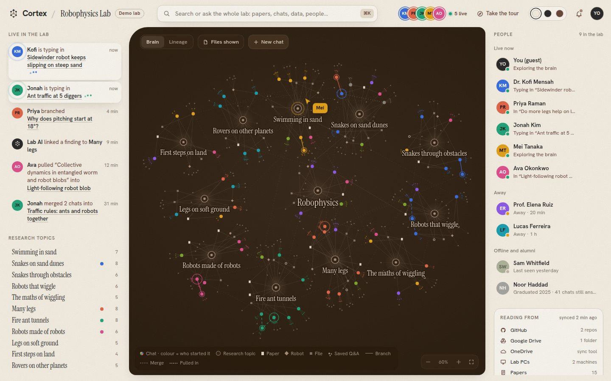
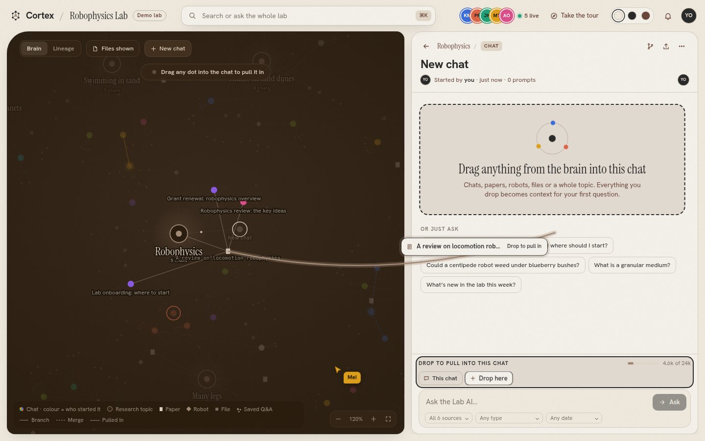
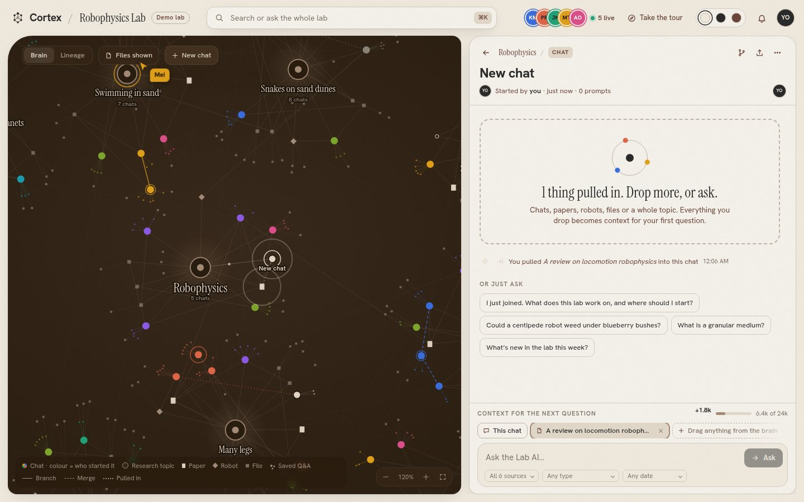
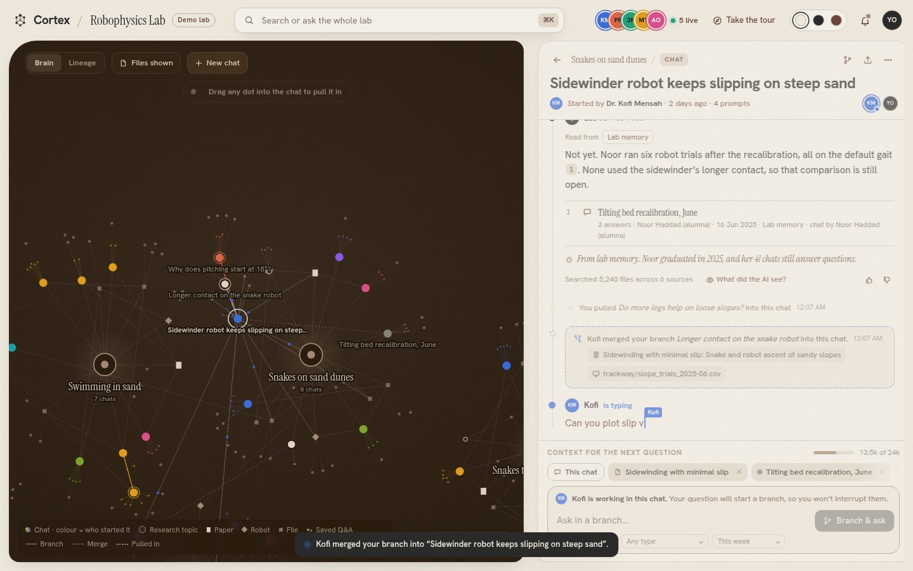
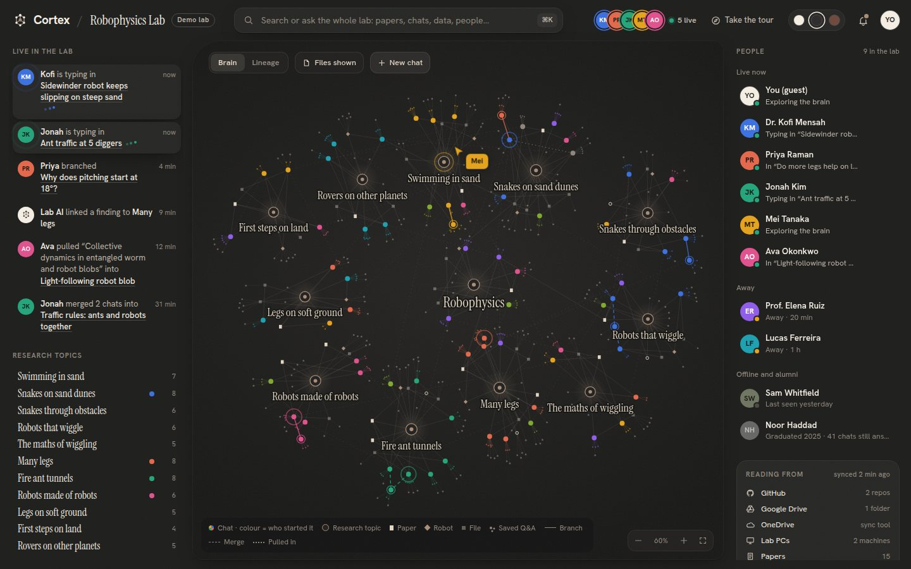
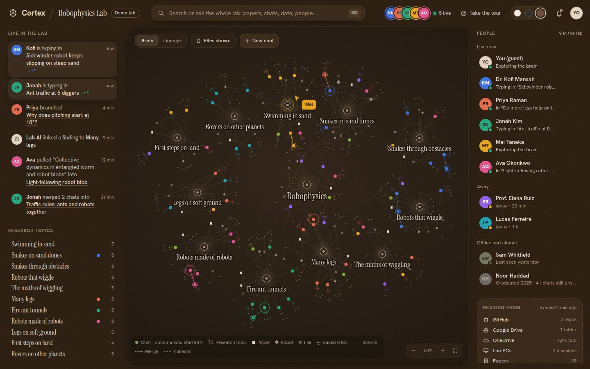
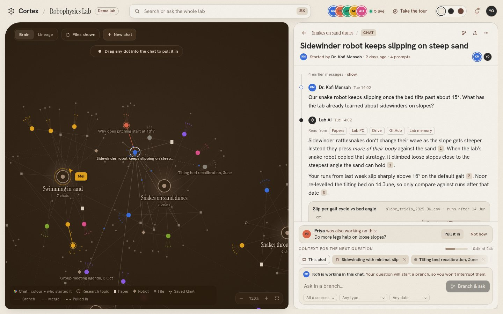
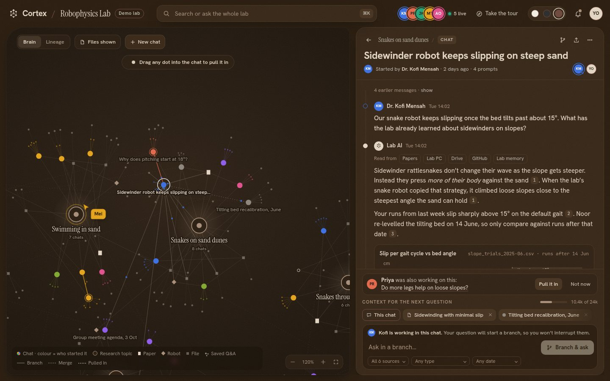

# Cortex prototype

A clickable prototype of Cortex for getting feedback from researchers, PIs and investors before the real build. It has no backend. Everything runs in the browser from mock data. The plan is in [`../PROTOTYPE-PLAN.md`](../PROTOTYPE-PLAN.md).

**Demo lab:** *Robophysics Lab*, built from the public work of Georgia Tech's CRAB Lab (Prof. Dan Goldman). The papers, robots and press are real and credited (see [`LAB-INVENTORY.md`](LAB-INVENTORY.md)). The teammates, their chats, everyday lab files and every number are illustrative. Not affiliated with the lab.



## Open it

| How | When |
|-----|------|
| **[`release/cortex-prototype.html`](release/cortex-prototype.html)** | Download and double-click. Works offline, no install. Best for meetings |
| GitHub Pages | After merging to `main` and turning on Pages (Settings → Pages → Source: GitHub Actions) |
| `npm install && npm run dev` | Working on it |

**Useful links and keys**
- `?theme=light`, `?theme=dark` or `?theme=mocha` picks a theme. The switch in the top bar does the same, and the choice is remembered.
- `?chat=c-slip` opens straight into the split view with the full example conversation.
- `Esc` backs out one layer at a time and finally flies back to the whole lab.

## What's in this version

Every button does something. The highlights:

**Drag anything into a chat.**
- Grab any dot on the brain (a chat, paper, robot, file, saved answer or a whole topic) and drag it out. It springs back into place, and a card follows your cursor on an elastic tether.
- The chat lights up as a drop target.
- Let go and the card flies into the context tray and pops in as a chip. The token budget fills, and a dotted "pulled in" line draws itself across the brain with a pulse at both ends.
- The chat logs it ("You pulled … into this chat"), and so does the Live feed.
- You can also drop a node on the open chat's own dot in the brain.
- On the home screen, dropping into the People rail starts a new chat with that context. **+ New chat** opens an empty chat to drag several things into before asking.

**Ask, branch, merge.**
- The search box lights up matching dots as you type, and Enter asks the Lab AI in a new chat.
- Answers come from a bank of about 20 scripted questions: new member onboarding, a new idea with a suggested pull, file finding, general background, meeting prep, disagreements, a draft paragraph and more. Anything else gets an honest "not found" with the closest files.
- Asking in Kofi's live chat starts a branch, and Kofi is notified. A few seconds later he merges your findings back, with a dashed merge line on the brain, a merge card in his chat and a notification for you.
- Click any message's port, or the header Branch button, to branch from that exact point.

**Every other control.**
- **Answers:** citations open the source as it looks where it lives, with real papers linking to their public pages. "What did the AI see?" opens the context manifest. The thumbs register a rating.
- **Chat panel:** "show" reveals earlier messages. Pull it in and Not now act on the suggestion. Chip × removes context. The filters are real dropdowns.
- **Downloads:** Export saves a `.md` of the chat, and the ⋯ menu copies a link, shows the chat on the brain, or downloads its memory card.
- **Top bar:** notifications open the chats they mention. The live avatars and the People rail's Follow make the camera follow that teammate. The You menu offers the tour, credits and a restart.
- **Brain:** Lineage glides every chat into topic rows, with branches and merges flowing right.
- **Take the tour:** 13 steps covering every feature. Each "Show me" button does the step for you, including a guided drag-in.

**Keyboard:** `Esc` backs out one layer at a time: tour, then panel, then drag, then chat.

| Dragging a paper into a new chat | It lands: chip, budget, a “pulled in” line on the brain |
|------|-------|
|  |  |



| Dark | Mocha |
|------|-------|
|  |  |
|  |  |

## Develop

```bash
npm install
npm run dev            # http://localhost:5173
npm run build          # static site in dist/ (what GitHub Pages serves)
npm run build:single   # one offline HTML file in dist-single/ → copy to release/
npx vite preview & node scripts/shots.mjs       # screenshots of every theme into shots/
npx vite preview & node scripts/clicktest.mjs   # clicks every control and drags nodes; prints a pass/fail list
```

```text
src/
  app/      shell, top bar + search, rails, tour, source viewer + manifest, drag layer + toasts
  brain/    graph data + force layout (graph.ts), canvas renderer, camera, drag-out (Brain.tsx)
  chat/     chat panel, message renderer, inline chart
  engine/   store, actions (every button), world (the live graph), question bank
  lab/      the lab: people, topics, papers, robots, files, chats, threads, source contents
  styles/   tokens.css (three themes) and app.css
  ui/       icons, avatars, cursors
```

**Design rules** (from the plan):
- Colour always means a person.
- Nothing moves without a cause.
- The AI has no colour.
- Line style carries meaning: branch = solid, merge = dashed, pulled in = dotted.
- Use plain words.
